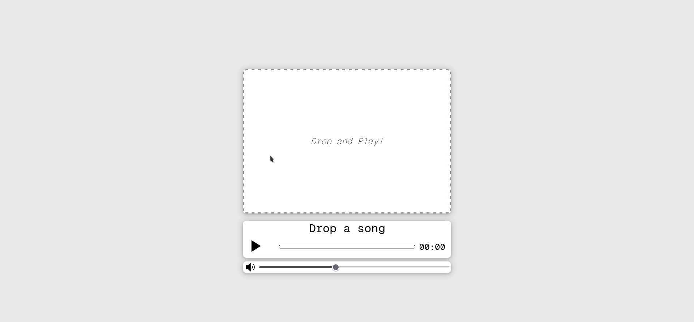

# DropAndPlay

**DropAndPlay** is a simple, web-based music player that allows you to easily drag and drop your audio files for instant playback. Enjoy a seamless music experience right from your browser.

## Features
- Drag and drop functionality to load audio files.
- Play, pause, and control audio playback directly from the interface.
- Lightweight and easy to use.

## Stack
- HTML
- JavaScript
- CSS

## Screenshot

## Demo Link
You can try the app here: [DropAndPlay Demo](https://ismaelvr1999.github.io/DropAndPlay/)
